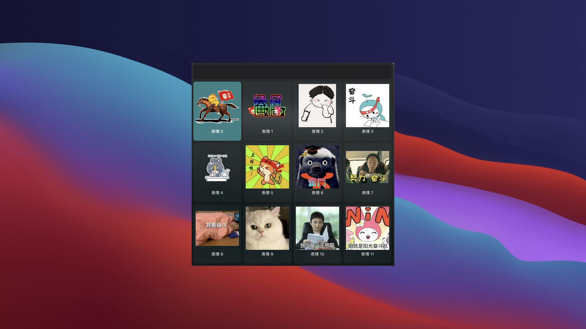
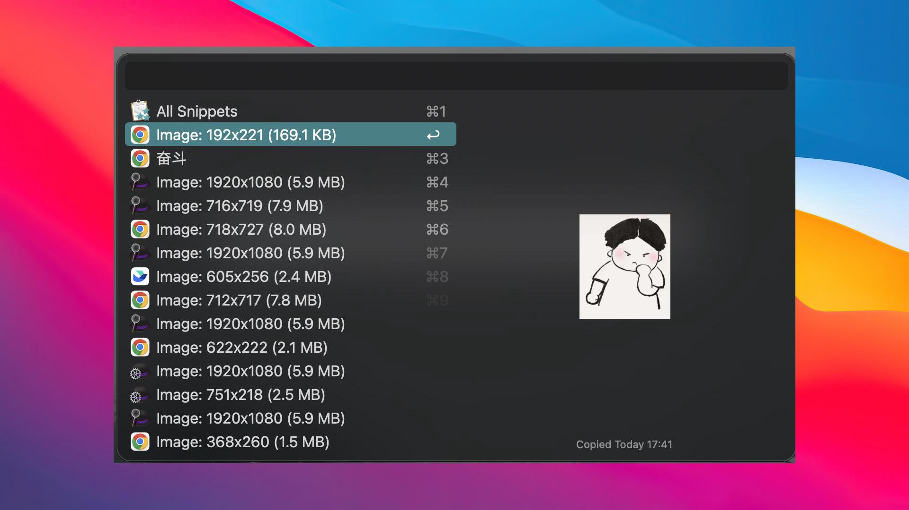
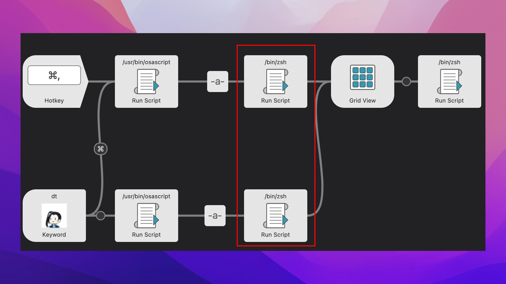

## doutu-flow
support doutu for alfred.

## Usage
1. Keyword trigger
    > select a keyword content, then call alfred:`dt` to trigger doutu flow.
2. Hotkey trigger
    > select a keyword content, then press hotkey:`command+,` to trigger doutu flow.

## Screenshot

Trigger search by 奋斗:

Choose one, will get:

## Flow and Custom

1. Get selected content by apple scripts
2. Trim selected content
3. Search content in custom api engine
4. Show image Grid View
5. Choose one and try to resize it

SO:
you can custom this flow with:
1. custom different image search engine or api.
2. custom image resize window in env config

## Install
1. Download the latest version of doutu-flow from [release](https://github.com/o98k-ok/doutu/releases) page.

## More
Waiting...